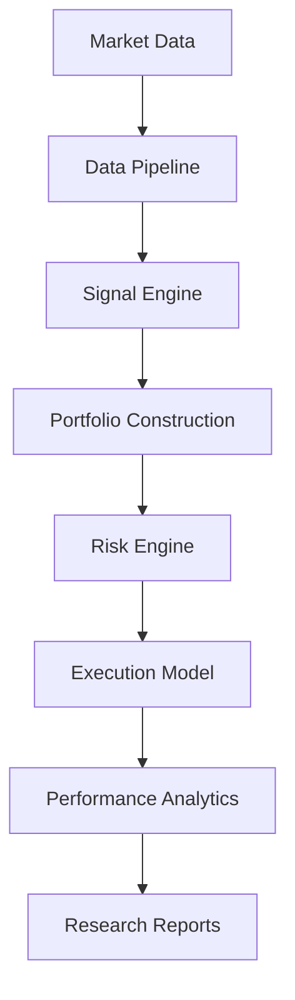

<div align="center">

# RiskLab

### Systematic Portfolio Research Engine

*A quantitative portfolio research framework for deterministic market microstructure research and systematic strategy evaluation.*

Quantitative Research &nbsp;•&nbsp; Portfolio Construction &nbsp;•&nbsp; Risk Management &nbsp;•&nbsp; Financial Machine Learning &nbsp;•&nbsp; Reproducible Finance

<br>


<br>


</div>

---

## Core Thesis

Most systematic investment strategies fail not because their alpha signal is incorrect, but because risk changes, volatility changes, transaction costs matter, portfolio construction matters, and static assumptions destroy theoretical alpha.

RiskLab exists to isolate genuine risk-adjusted performance under realistic portfolio constraints.

---

## Headline Results

Portfolio-level volatility targeting stabilized realized volatility while improving risk-adjusted performance relative to the unmanaged multi-asset portfolio.

### Performance Summary

| Strategy | CAGR | Annualized Volatility | Sharpe Ratio |
|----------|-----:|----------------------:|-------------:|
| Buy & Hold (SPY) | 8.86% | 19.07% | 0.541 |
| Volatility-Targeted Momentum (SPY) | 5.72% | 11.13% | 0.555 |
| Multi-Asset Portfolio | 2.52% | 5.89% | 0.452 |
| **10% Volatility-Targeted Portfolio** | **4.76%** | **10.16%** | **0.509** |

*Note: The asset universe comprises SPY (U.S. Equities), QQQ (Technology Equities), GLD (Gold), TLT (U.S. Treasury Bonds), DBC (Commodities), and VNQ (Real Estate).*

**Interpretation:** The unmanaged multi-asset momentum portfolio suffers from volatility drag and structural under-exposure during quiet market regimes. By applying a 10% portfolio-level annualized volatility target, RiskLab scales exposure dynamically. This mechanism structurally reduces drawdown severity and smooths the equity curve, yielding a robust improvement in the Sharpe ratio while accurately constraining realized volatility to the predetermined target.

<p align="center">

</p>

<p align="center">

</p>

---

## Why RiskLab Exists

Traditional backtests often answer:
*"Did this strategy make money?"*

RiskLab instead asks:
*"Why did this strategy succeed or fail after accounting for realistic risk management?"*

Historical returns in isolation provide limited insight into the structural robustness of an alpha signal. RiskLab is built to scrutinize the mechanics that intermediate signal and return:

- **Dynamic Volatility:** How do signals perform when normalized for regime-specific risk?
- **Transaction Costs:** Does portfolio turnover erode the statistical edge?
- **Portfolio Construction:** Are equal-weight allocations suboptimal compared to risk-adjusted frameworks?
- **Position Sizing:** How do constraints on leverage and gross exposure alter the return distribution?
- **Risk Budgeting:** Can dynamic capital allocation stabilize portfolio drawdowns?
- **Multi-Asset Diversification:** How does regime-dependent cross-asset correlation impact aggregate risk?

---

## System Architecture

RiskLab employs a strict separation of concerns, ensuring that distinct quantitative processes remain highly cohesive and loosely coupled.



This modular separation matters because it enables robust experimentation. New alpha models should plug into the **Signal Engine** without modifying downstream infrastructure. A researcher testing a new alpha factor does not need to rewrite the execution simulator, the volatility targeting logic, or the performance attribution layers.

---

## Research Framework

RiskLab operates as a reusable research infrastructure comprising independent components designed for institutional-grade experimentation.

### Data Layer
**Purpose:** Ensure clean, aligned, and survivorship-bias-free data ingestion.  
**Responsibilities:** Abstraction of data sourcing.  
**Extensibility:** Allows researchers to transition from static CSV files to SQL databases seamlessly.

### Signal Engine
**Purpose:** Transform raw feature sets into directional forecasts.  
**Responsibilities:** Enforces strict look-ahead bias prevention during historical signal calculation.  
**Extensibility:** Supports time-series, cross-sectional, and macroeconomic signals.

### Portfolio Construction
**Purpose:** Map raw alpha signals into target portfolio weights.  
**Responsibilities:** Applies capital allocation algorithms across the asset universe.  
**Extensibility:** Interchangeable optimizers (e.g., Equal-Weight, Risk Parity, Black-Litterman).

### Risk Engine
**Purpose:** Overlay dynamic risk constraints prior to simulated execution.  
**Responsibilities:** Computes rolling covariance matrices, scales gross exposure to target ex-ante volatility, and tracks leverage.  
**Extensibility:** Pluggable covariance estimators and drawdown controls.

### Execution Model
**Purpose:** Simulate realistic market implementation.  
**Responsibilities:** Models slippage, commissions, and execution delay.  
**Extensibility:** Parameterized friction to test robustness across varying cost environments.

### Performance Analytics
**Purpose:** Attribute returns with statistical rigor.  
**Responsibilities:** Decouples raw PnL from evaluation, generating standardized metrics.  
**Extensibility:** Agnostic to strategy design, measuring performance across arbitrary return streams.

### Visualization
**Purpose:** Provide consistent visual interpretations of strategy behavior.  
**Responsibilities:** Renders wealth curves, underwater plots, and exposure distributions.  
**Extensibility:** Generates standard plots that abstract away manual matplotlib boilerplate.

### Experiment Framework
**Purpose:** Facilitate automated strategy comparison.  
**Responsibilities:** Manages parameter space sensitivity analysis and standardized report generation.  
**Extensibility:** Easily scale from single-strategy backtests to multi-dimensional grid searches.

---

## Current Research Study

### Study I: Volatility-Targeted Time-Series Momentum

**Research Question:** Does portfolio-level volatility targeting improve the risk-adjusted returns of a diversified time-series momentum portfolio relative to static approaches?

**Methodology:** A basic time-series momentum signal is evaluated across six asset classes. Rather than holding fixed positions, the multi-asset portfolio is scaled by an expanding window covariance estimate to target a constant 10% annualized volatility.

**Experimental Setup:** The study compares four portfolios:
1. Buy & Hold (Passive SPY benchmark)
2. Single-Asset Momentum (Signal applied to SPY with volatility scaling)
3. Multi-Asset Momentum Portfolio (Equal-weight diversified momentum across all six assets)
4. Volatility-Targeted Portfolio (Multi-asset momentum scaled to a 10% volatility target)

**Evaluation:** Evaluated on realistic, transaction-cost-adjusted metrics focusing on drawdown severity, rolling Sharpe ratios, and leverage constraints.

**Results:** The volatility-targeted momentum portfolio successfully stabilizes realized volatility (10.16% vs the 10% target) and achieves a Sharpe ratio of 0.509, outperforming the unscaled multi-asset equivalent (0.452).

**Interpretation:** Volatility scaling organically applies leverage during low-volatility regimes and de-levers during high-variance market stress. This mechanism materially reduces drawdown severity at the cost of slight CAGR drag due to leverage limits, confirming that scaling improves risk-adjusted returns structurally.

**Limitations:** The current study employs a rudimentary lookback signal without cross-sectional ranking and utilizes ETF proxies instead of futures contracts.

**Future Extensions:** Advancing the risk overlay using GARCH-based covariance forecasts and hierarchical clustering.

---

## Methodology

RiskLab standardizes the research pipeline to ensure empirical validity. Every strategy follows this processing graph:

```text
Historical Data
↓
Feature Engineering
↓
Signal Generation
↓
Portfolio Construction
↓
Risk Management
↓
Execution Simulation
↓
Performance Attribution
↓
Statistical Evaluation
↓
Research Report
```

---

## Framework Components

- **research/**: Formal hypothesis testing and documented Jupyter Notebook studies. Exists to preserve the narrative of why a strategy was built.
- **signals/**: Alpha generation models and feature extraction logic. Decoupling signals ensures that poor performance is isolated to the forecast rather than structural portfolio flaws.
- **portfolio/**: Asset allocation algorithms. Exists to evaluate how weighting methodologies (e.g., equal-weight vs. optimal) affect an identical alpha stream.
- **risk/**: Rolling covariance estimators, volatility scaling, and limits. Provides the mathematical boundary conditions for the portfolio.
- **analytics/**: Pure functions for calculating drawdowns, Sharpe, and Sortino ratios. Ensures metrics are uniformly computed across all studies.
- **reports/**: Artifacts, tearsheets, and visualizations generated by the experiment framework.
- **docs/**: Methodological documentation and academic references.

---

## Performance Evaluation

RiskLab evaluates strategies across a comprehensive suite of institutional metrics.

- **CAGR:** The geometric progression ratio providing the normalized annual rate of return. Evaluates long-term absolute wealth generation.
- **Annualized Volatility:** The standard deviation of daily returns, annualized. Serves as the primary proxy for strategy uncertainty and variance penalty.
- **Sharpe Ratio:** The excess return per unit of total risk. Assesses whether the theoretical alpha compensates adequately for the experienced variance.
- **Maximum Drawdown:** The largest peak-to-trough drop in portfolio equity. Quantifies left-tail risk and structural vulnerability to market shocks.
- **Calmar Ratio:** The ratio of CAGR to Maximum Drawdown. Highlights return efficiency relative to extreme loss environments.
- **Turnover:** The percentage of the portfolio replaced over a given period. Dictates scalability, capacity, and expected transaction friction.
- **Transaction Costs:** Simulated frictional drag applied to turnover. Identifies whether an alpha signal survives implementation reality.

---

## Reproducibility

Financial research is fundamentally flawed if it cannot be strictly reproduced. RiskLab ensures deterministic validation through:

- **Modular Architecture:** Core logic is fully abstracted from data inputs and execution layers.
- **Deterministic Experiments:** Fixed random seeds, configuration-driven design, and immutable parameters guarantee identical outcomes across runs.
- **Unit Tests:** Rigorous assertion checks prevent look-ahead bias and validate statistical boundary conditions continuously.
- **Jupyter Notebooks:** Complete, state-preserved environments that transparently document the analytical journey.
- **Automatic Report Generation:** Standardized programmatic teardowns eliminate subjective charting and selective metric reporting.

Every experiment in RiskLab is designed to be fully reproducible.

---

## Repository Layout

```text
RiskLab/
│
├── research/
├── signals/
├── portfolio/
├── risk/
├── analytics/
├── reports/
├── docs/
│
├── README.md
├── requirements.txt
├── setup.py
└── .gitignore
```

---

## Future Research Roadmap

RiskLab is a continuously expanding research platform. Potential future studies include:

- **Study II:** Cross-Sectional Momentum
- **Study III:** Risk Parity
- **Study IV:** Hierarchical Risk Parity
- **Study V:** Kelly Allocation
- **Study VI:** Black-Litterman
- **Study VII:** Factor Investing
- **Study VIII:** Regime Detection
- **Study IX:** Volatility Forecasting
- **Study X:** Bayesian Portfolio Optimization

---

## Design Principles

- **Modularity:** Components must be independently testable and universally reusable across diverse studies.
- **Reproducibility:** Every statistical claim must be verifiable through a deterministic execution pipeline.
- **Risk-First Thinking:** Capital allocation is fundamentally an exercise in risk budgeting, not mere return maximization.
- **Transparent Evaluation:** Assumptions, heuristics, and structural failures must be explicitly documented.
- **Statistical Rigor:** Returns are meaningless without adjusting for volatility, transaction costs, and sample bias.
- **Extensibility:** The framework must easily accommodate new alpha signals and optimizers without refactoring underlying core logic.
- **Configuration-Driven Research:** Parameters should be abstracted into configurations, facilitating unbiased grid search and sensitivity analysis.

---

## Known Limitations

Transparency is a prerequisite for rigorous research. The current implementation operates under the following constraints:

- **Historical Backtesting:** Results are purely simulated; past performance is structurally not indicative of future outcomes.
- **Absence of Live Execution:** The framework lacks API bindings for live brokerages and does not process real-time market microstructure data.
- **Simplified Transaction Cost Model:** Friction is modeled using static assumptions rather than dynamic order-book impact and realistic bid-ask spread simulation.
- **Limited Asset Universe:** Studies currently utilize ETFs as proxies. Direct futures contracts would introduce margin mechanics and roll-yield considerations not yet modeled.
- **Parameter Assumptions:** Lookback periods and target volatilities are heuristically selected; robust out-of-sample parameter optimization is required for future validation.
- **Future Validation Requirements:** Statistical significance must be continuously verified across out-of-sample data sets and shifting market regimes.

---

## Implementation Details

**Clone the repository**
```bash
git clone https://github.com/Zylus08/RiskLab.git
cd RiskLab
```

**Install dependencies**
```bash
pip install -r requirements.txt
```

**Run the test suite**
```bash
pytest tests/
```

**Launch the research framework**
```bash
jupyter notebook research/02_Main_Backtest.ipynb
```

---

## References

- Moskowitz, T., Ooi, Y., & Pedersen, L. (2012). *Time Series Momentum*. Journal of Financial Economics.
- Moreira, A., & Muir, T. (2017). *Volatility-Managed Portfolios*. Journal of Finance.
- Barroso, P., & Santa-Clara, P. (2015). *Momentum Has Its Moments*. Journal of Financial Economics.
- Hurst, B., Ooi, Y., & Pedersen, L. (2017). *A Century of Evidence on Trend-Following Investing*. AQR Capital Management.

## Citation

```bibtex
@software{skmishra2026risklab,
  title   = {RiskLab: A Research Framework for Systematic Portfolio Construction and Risk Management},
  author  = {Saksham Mishra},
  year    = {2026},
  url     = {https://github.com/Zylus08/RiskLab}
}
```

## License

This project is released under the MIT License.

---

## Conclusion

RiskLab was not built to maximize historical returns.

It was built to provide a reusable research environment for systematically studying how portfolio construction, dynamic risk management, and execution assumptions influence long-term investment performance.

<div align="center">
<br>
<em>RiskLab — built for research, designed for extensibility.</em>
</div>
