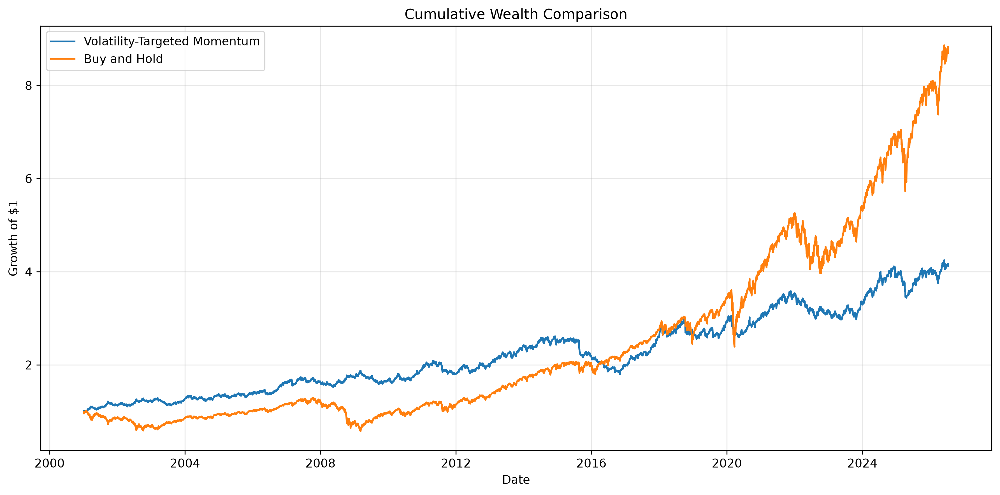
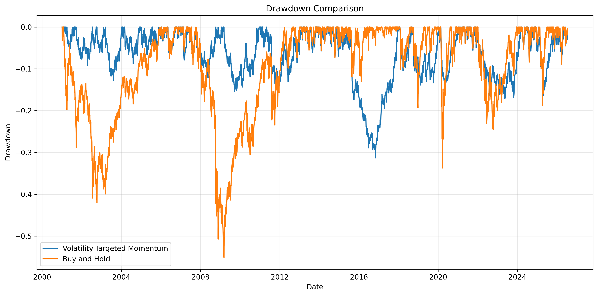

<div align="center">

# RiskLab

### Research Framework for Systematic Portfolio Construction & Risk Management

Portfolio Construction &nbsp;•&nbsp; Risk Management &nbsp;•&nbsp; Systematic Investing &nbsp;•&nbsp; Quantitative Research &nbsp;•&nbsp; Reproducible Finance

<br>


<br>


</div>

---

## Abstract

RiskLab is a modular quantitative research framework for designing, evaluating, and comparing systematic investment strategies under realistic portfolio constraints. The framework provides reusable components for signal generation, portfolio construction, volatility targeting, transaction cost modelling, performance attribution, and statistical evaluation.

The first implemented strategy investigates whether portfolio-level volatility targeting improves the risk-adjusted performance of a diversified time-series momentum portfolio across multiple asset classes.

---

## Motivation

Traditional systematic strategies typically optimise for returns while assuming static risk. In practice:

- volatility is time-varying,
- cross-asset correlations shift across regimes,
- portfolio leverage changes with market conditions,
- transaction costs erode theoretical alpha.

**RiskLab investigates a central question:** how should systematic portfolios dynamically adapt their exposure as market risk evolves — and what is the measurable cost and benefit of doing so?

---

## Research Questions

- Does portfolio-level volatility targeting improve risk-adjusted returns over static momentum strategies?
- Does multi-asset diversification improve the robustness of time-series momentum signals?
- What is the empirical trade-off between portfolio turnover and risk-adjusted performance?
- How stable are systematic strategies across different market regimes and volatility environments?

---

## Framework Architecture

```text
Market Data
       │
       ▼
Data Pipeline
       │
       ▼
Signal Engine
       │
       ▼
Portfolio Construction
       │
       ▼
Risk Engine
       │
       ▼
Execution Model
       │
       ▼
Performance Analytics
       │
       ▼
Research Reports
```

---

## Core Modules

### Data Layer
- Historical market data ingestion (multi-asset ETF universe)
- Daily log and arithmetic return computation
- Data validation and alignment

### Signal Engine

**Current**
- Time-Series Momentum (lookback-based sign signal)

**Planned**
- Cross-Sectional Momentum
- Mean Reversion
- Carry
- Value / Quality

### Portfolio Engine

**Current**
- Equal-Weight Construction
- Single-Asset Volatility Scaling
- Portfolio-Level Volatility Targeting

**Planned**
- Hierarchical Risk Parity (HRP)
- Black-Litterman
- Risk Parity
- Kelly Allocation

### Risk Engine
- Rolling volatility estimation
- Drawdown and underwater curve analysis
- Leverage and exposure tracking
- Portfolio turnover computation

### Analytics
- CAGR, Sharpe, Sortino, Calmar
- Maximum Drawdown
- Rolling performance metrics
- Sensitivity analysis across parameter space

---

## Current Research

### Study I — Portfolio-Level Volatility Targeting

**Objective:** Evaluate whether dynamically scaling a diversified momentum portfolio to a fixed annualized volatility target improves its risk-adjusted performance relative to unscaled alternatives.

#### Asset Universe

| ETF | Asset Class |
|-----|-------------|
| SPY | U.S. Equities |
| QQQ | Technology Equities |
| GLD | Gold |
| TLT | U.S. Treasury Bonds |
| DBC | Commodities |
| VNQ | Real Estate |

#### Strategies Evaluated

| # | Strategy | Description |
|---|----------|-------------|
| 1 | Buy & Hold | Passive benchmark (SPY) |
| 2 | Single-Asset Momentum | Momentum signal applied to SPY with volatility scaling |
| 3 | Multi-Asset Momentum Portfolio | Equal-weight diversified momentum across all six assets |
| 4 | Volatility-Targeted Portfolio | Portfolio-level scaling to a 10% annualized volatility target |

---

## Results

The study demonstrates that portfolio-level volatility targeting successfully stabilises realised portfolio volatility at the desired annualized target while maintaining competitive long-term returns. Volatility targeting materially reduces drawdown severity and smooths the equity curve relative to unscaled strategies — at the cost of some CAGR drag attributable to leverage constraints during low-volatility regimes.

### Performance Summary

| Strategy | CAGR | Annualized Volatility | Sharpe Ratio |
|----------|-----:|----------------------:|-------------:|
| Buy & Hold (SPY) | 8.86% | 19.07% | 0.541 |
| Volatility-Targeted Momentum (SPY) | 5.72% | 11.13% | 0.555 |
| Multi-Asset Portfolio | 2.52% | 5.89% | 0.452 |
| 10% Volatility-Targeted Portfolio | 4.76% | 10.16% | 0.509 |

### Wealth Curves

<p align="center">

</p>

### Drawdown Comparison

<p align="center">

</p>

---

## Repository Structure

```text
RiskLab/
│
├── notebooks/
│   ├── 01_Analysis.ipynb
│   └── 02_Main_Backtest.ipynb          ← primary reproducible research notebook
│
├── src/
│   ├── data_loader.py                  ← data ingestion & return computation
│   ├── signals.py                      ← momentum signal generation
│   ├── volatility.py                   ← rolling volatility & scaling
│   ├── multi_asset.py                  ← portfolio construction
│   ├── backtest.py                     ← backtesting engine
│   ├── experiments.py                  ← strategy comparison experiments
│   ├── metrics.py                      ← performance analytics
│   └── visualization.py               ← charting & reporting
│
├── tests/
│   ├── test_backtest.py
│   ├── test_metrics.py
│   ├── test_volatility.py
│   └── test_no_lookahead.py            ← look-ahead bias validation
│
├── results/
│   ├── wealth_curves.png
│   └── drawdowns.png
│
├── README.md
├── requirements.txt
└── .gitignore
```

---

## Quickstart

**Clone the repository**

```bash
git clone https://github.com/Zylus08/Volatility-Targeted-Time-Series-Momentum.git
cd Volatility-Targeted-Time-Series-Momentum
```

**Install dependencies**

```bash
pip install -r requirements.txt
```

**Run the test suite**

```bash
pytest tests/
```

**Launch the research notebook**

```bash
jupyter notebook notebooks/02_Main_Backtest.ipynb
```

Run all cells to reproduce the full analysis.

---

## Roadmap

### Planned Research Studies

| Study | Topic | Status |
|-------|-------|--------|
| Study I | Portfolio-Level Volatility Targeting | ✅ Complete |
| Study II | Cross-Sectional Momentum | 🔲 Planned |
| Study III | Mean Reversion Signals | 🔲 Planned |
| Study IV | Risk Parity & HRP Allocation | 🔲 Planned |
| Study V | Regime Detection & Conditional Strategies | 🔲 Planned |
| Study VI | Volatility Forecasting (GARCH / ML) | 🔲 Planned |
| Study VII | Factor Investing & Style Premia | 🔲 Planned |
| Study VIII | Bayesian Portfolio Optimisation | 🔲 Planned |

---

## Principles

RiskLab is designed around five research principles:

1. **Reproducibility** — every result is generated from a single, self-contained notebook
2. **Modularity** — components are independently testable and reusable across studies
3. **Statistical Rigor** — strategies are evaluated on realistic, transaction-cost-adjusted metrics
4. **Transparent Evaluation** — results are reported with full methodology, including limitations
5. **Extensibility** — new signals, allocators, and risk models can be added without rewriting existing code

---

## References

- Moskowitz, T., Ooi, Y., & Pedersen, L. (2012). *Time Series Momentum*. Journal of Financial Economics.
- Moreira, A., & Muir, T. (2017). *Volatility-Managed Portfolios*. Journal of Finance.
- Barroso, P., & Santa-Clara, P. (2015). *Momentum Has Its Moments*. Journal of Financial Economics.
- Hurst, B., Ooi, Y., & Pedersen, L. (2017). *A Century of Evidence on Trend-Following Investing*. AQR Capital Management.

---

## Citation

```bibtex
@software{skmishra2026risklab,
  title   = {RiskLab: A Research Framework for Systematic Portfolio Construction and Risk Management},
  author  = {Saksham Mishra},
  year    = {2026},
  url     = {https://github.com/Zylus08/RiskLab}
}
```

---

## License

This project is released under the MIT License.

---

<div align="center">

*RiskLab — built for research, designed for extensibility.*

</div>
